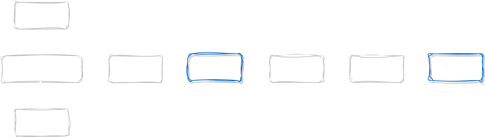

# Main Link
- [Tools and Scripts](https://voorivex-hunt-course.notion.site/Tools-and-Scripts-8d4ebda5621a42ea87407ac8949336df)

# Scripts
### [Useful Bash Scripts](https://www.notion.so/Useful-Bash-Scripts-4bd99bc84016497c929c11b538a27ec9?pvs=21)
Getting SSL certificate by `openssl`

```bash
get_certificate(){
    echo | openssl s_client -showcerts -servername $1 -connect $1:443 2>/dev/null | openssl x509 -inform pem -noout -text
}
```

Getting SSL certificate and extracting the Alternative Names and Common Names by `Nuclei`:

```bash
get_certificate_nuclei(){
    input=""
    while read line && [[ "$line" != "END_OF_INPUT" ]]; do
        input="$input$line\n"
    done
    echo $input | nuclei -t ~/ssl.yaml -silent -j | jq -r '.["extracted-results"][]'
}
```

AbuseIP bash script:

```bash
abuseipdb(){
    curl -s "https://www.abuseipdb.com/whois/$1" -H "user-agent: Chrome" | grep -E '<li>\w.*</li>' | sed -E 's/<\/?li>//g'
		# curl -s https://www.abuseipdb.com/TARGET -H "user-agent: firefox" -b "abuseipdb_session=YOUR-SESSION"
}
```

Get ASN:

```bash
get_asn(){
	curl -s https://api.bgpview.io/ip/$1 | jq -r ".data.prefixes[] | {prefix: .prefix, ASN: .asn.asn}"
}
```

HTTPx equipped with user agent and referrer (manual work)

```bash
httpx_full(){
    input=""
    while read line
    do
        echo $line | httpx -silent -follow-host-redirects -title -status-code -cdn -tech-detect -H "User-Agent: Mozilla/5.0 (Macintosh; Intel Mac OS X 10.15; rv:108.0) Gecko/20100101 Firefox/108.0" -H "Referer: $line"
    done < "${1:-/dev/stdin}"
}
```

HTTPx equipped with user agent and referrer

```bash
httpx_full_silent(){
    input=""
    while read line
    do
        echo $line | httpx -silent -H "User-Agent: Mozilla/5.0 (Macintosh; Intel Mac OS X 10.15; rv:108.0) Gecko/20100101 Firefox/108.0" -H "Referer: $line" -th
    done < "${1:-/dev/stdin}"
}
```

Naabu with appropriate ports

```bash
nice_naabu(){
    input=""
    while read line && [[ "$line" != "END_OF_INPUT" ]]; do
        input="$input$line\n"
    done
    echo $input | naabu -p 80,8000,8080,8880,2052,2082,2086,2095,443,2053,2083,2087,2096,8443,10443 -silent
}
```

Masscan with appropriate ports

```bash
nice_masscan(){
    masscan $1 --open --ports 80,443,444,1443,1455,2000,2020,2052,2053,2082,2083,2086,2087,2095,2096,2222,3000,3003,3030,3300,3306,3333,4000,4040,4400,4440,4443,4444,4900,5000,5030,5050,5432,5500,5555,6000,6100,6666,7000,7007,7008,7700,7777,8000,8080,8090,8100,8180,8200,8300,8400,8443,8500,8600,8700,8800,8880,8888,8899,9000,9009,9040,9050,9080,9090,9100,9200,9300,9400,9500,9898,9900,9999,10443,27017 -oL masscan-res.txt && grep "open" masscan-res.txt | awk '{print $4 ":" $3}'
}
```

Get PTR

```bash
getptr(){
    input=""
    while read line && [[ "$line" != "END_OF_INPUT" ]]; do
        input="$input$line\n"
    done
    echo $input | dnsx -silent -resp-only -ptr
}
```

CrtSh bash function

```bash
crtsh(){
    query=$(cat <<-END
        SELECT
            ci.NAME_VALUE
        FROM
            certificate_and_identities ci
        WHERE
            plainto_tsquery('certwatch', '$1') @@ identities(ci.CERTIFICATE)
END
)
    echo "$query" | psql -t -h crt.sh -p 5432 -U guest certwatch | sed 's/ //g' | egrep ".*.\.$1" | sed 's/*\.//g' | tr '[:upper:]' '[:lower:]' | sort -u
}
```

Python to calculate favicon hash

```python
import mmh3
import requests
import codecs
import sys

from requests.packages.urllib3.exceptions import InsecureRequestWarning
requests.packages.urllib3.disable_warnings(InsecureRequestWarning)

if len(sys.argv) < 2:
	print("[!] Error!")
	print(f"[-] Use: python3 {sys.argv[0]} http://example.com/favicon.ico")
	print("[i] Get all hosts with the same favicon!")
	sys.exit()

def main():
	response = requests.get(sys.argv[1], verify=False)
	favicon = codecs.encode(response.content,"base64")
	hash_favicon = mmh3.hash(favicon)

	print("[!] http.favicon.hash:"+str(hash_favicon))
	print("[*] View Results:\n> https://www.shodan.io/search?query=http.favicon.hash%3A"+str(hash_favicon))

if __name__ == '__main__':
	main()
```

SourceGraph:

```bash
github_scan(){
    DOMAIN=$1
    q=$(echo $DOMAIN | sed -e 's/\./\\\./g')
    src search -json '([a-z\-]+)?:?(\/\/)?([a-zA-Z0-9]+[.])+('${q}') count:5000 fork:yes archived:yes' | jq -r '.Results[] | .lineMatches[].preview, .file.path' | grep -oiE '([a-zA-Z0-9]+[.])+('${q}')' | awk '{ print tolower($0) }' | sort -u
}
```

Get subdomains

```bash
get_subs () {
	domain=$1
	crtsh $domain | grep -v "*" | sort -u > ${domain}.subs
	echo "[Subfinder]"
	subfinder -d $domain -all -silent | anew ${domain}.subs
	echo "[abuseipdb]"
	abuseipdb $domain | anew ${domain}.subs
	echo "[github_scan]"
	github_scan $domain | anew ${domain}.subs
}
```

Get ASN of an IP:

```bash
get_ip_asn () {
	input=""
	while read line
	do
		curl -s https://api.bgpview.io/ip/$line -H "User-Agent: Mozilla/5.0 (Macintosh; Intel Mac OS X 10.15; rv:108.0) Gecko/20100101 Firefox/108.0" | jq -r ".data.prefixes[0].asn.asn"
	done < "${1:-/dev/stdin}"
}
```

Get ASN details

```bash
get_asn_details () {
	input=""
	while read line
	do
		curl -s https://api.bgpview.io/asn/$line/prefixes -H "User-Agent: Mozilla/5.0 (Macintosh; Intel Mac OS X 10.15; rv:108.0) Gecko/20100101 Firefox/108.0" | jq -r ".data.ipv4_prefixes[0] | {prefix: .prefix, name: .description}"
	done < "${1:-/dev/stdin}"
}
```

`Masscan` function

```bash
nice_masscan_list () {
	masscan -iL $1 --open --ports 80,443,444,1443,1455,2000,2020,2052,2053,2082,2083,2086,2087,2095,2096,2222,3000,3003,3030,3300,3306,3333,4000,4040,4400,4440,4443,4444,4900,5000,5030,5050,5432,5500,5555,6000,6100,6666,7000,7007,7008,7700,7777,8000,8080,8090,8100,8180,8200,8300,8400,8443,8500,8600,8700,8800,8880,8888,8899,9000,9009,9040,9050,9080,9090,9100,9200,9300,9400,9500,9898,9900,9999,10443,27017 -oL masscan-res.txt && grep "open" masscan-res.txt | awk '{print $4 ":" $3}'
}
```

`wlist_maker` function:

```bash
wlist_maker () {
	seq 1 100 > list.tmp
	echo $1 >> list.tmp
	seq 101 300 >> list.tmp
	echo $1 >> list.tmp
	seq 301 600 >> list.tmp
}
```

`nice_wayback` function:

```bash
nice_wayback(){
    while read line
    do
        host=$(echo $line | unfurl format %d)
        echo "$line" | waybackurls | grep -Eiv '\.(css|jpg|jpeg|png|svg|img|gif|exe|mp4|flv|pdf|doc|ogv|webm|wmv|webp|mov|mp3|m4a|m4p|ppt|pptx|scss|tif|tiff|ttf|otf|woff|woff2|bmp|ico|eot|htc|swf|rtf|image|rf)' | sort -u | tee ${host}.waybackurls
    done < "${1:-/dev/stdin}"
}
```

`nice_gau` function:

```bash
nice_gau(){
    while read line
    do
        host=$(echo $line | unfurl format %d)
        echo "$host" | gau | grep -Eiv '\.(css|jpg|jpeg|png|svg|img|gif|exe|mp4|flv|pdf|doc|ogv|webm|wmv|webp|mov|mp3|m4a|m4p|ppt|pptx|scss|tif|tiff|ttf|otf|woff|woff2|bmp|ico|eot|htc|swf|rtf|image|rf)' | sort -u | tee ${host}.gau
        done < "${1:-/dev/stdin}"
}
```

`nice_katana` function:
```bash
nice_katana(){
    while read line
    do
        host=$(echo $line | unfurl format %d)
        echo "$line" | katana -js-crawl -known-files -automatic-form-fill -silent -crawl-scope $host -extension-filter css,jpg,jpeg,png,svg,img,gif,mp4,flv,pdf,doc,ogv,webm,wmv,webp,mov,mp3,m4a,m4p,ppt,pptx,scss,tif,tiff,ttf,otf,woff,woff2,bmp,ico,eot,htc,swf,rtf,image -headers 'User-Agent: Mozilla/5.0 (Macintosh; Intel Mac OS X 10.15; rv:108.0) Gecko/20100101 Firefox/108.0' | tee ${host}.katana
    done < "${1:-/dev/stdin}"
}
```

# Nuclei Templates
### [Nuclei Templates](https://www.notion.so/Nuclei-Templates-d0aea122138f46fc844944f1d3b196f8?pvs=21)
SSL field extractor:\
```yaml
id: ssl-dns-names

info:
  name: SSL DNS Names
  author: pdteam
  severity: info
  tags: ssl

ssl:
  - address: "{{Host}}:{{Port}}"

    extractors:
      - type: json
        json:
          - ".subject_an[]"

      - type: json
        json:
          - ".subject_cn"
```

# Custom Tools
### [Nice DNS Brute](https://www.notion.so/Nice-DNS-Brute-b71626518e304feb9ac72e1234f678e9?pvs=21)
The flowchart is something like that:

1. Conduct a subdomain enumeration or get subdomain file as an input
2. Merge subdomains and static wordlist as an input for `ShuffleDNS` 
3. Conduct a name resolution by `ShuffleDNS` and save the results
4. Merge the **subdomains** and **resolved** list and run `DNSGen`, save the list
5. Use the list to conduct a name resolution by `ShuffleDNS` again and save the results
6. Merge the lists and make it uniq



### [RoboFinder](https://www.notion.so/RoboFinder-0128c8617ac14d499fd8229d408be52b?pvs=21)
RoboFinder is a tool to extract `robots.txt` contents from archive

The flow is simple:


- Make HTTP request to [https://web.archive.org](https://web.archive.org/) to get all indexes, use various filters to decrease the results
    
    ```
    https://web.archive.org/cdx/search/cdx?url=https://target.com/robots.txt&output=json&filter=statuscode:200&fl=timestamp,original&collapse=digest
    ```
    
- Request to all indexes to fetch content of saved `robots.txt`
    
    ```
    https://web.archive.org/web/[timestamp]if_/http://playcanvas.com/robots.txt
    ```
    
- Extract all paths from all indexes and make the output unique and pretty

### [fAllParams](https://www.notion.so/fAllParams-d4e848a3a9794df9adab908740192f4a?pvs=21)
It’s a tool to extract all parameters, paths, etc from given URLs:

The modes:

- HTML parsing
    - `<input>` tag, `id` attribute
    - `<input>` tag, `name` attribute
    - `<a>` tag, `href` attribute (path, parameters, etc)
- JavaScript parsing
    - Variable names
    - JSON objects

 


### [GMiner](https://www.notion.so/GMiner-bc87162674cc4e9d90d3d8a4c3f051b0?pvs=21)
It is a client-server tool to collect the various information from target. This information includes

- Parameter lists
- File names
- Endpoints
- RAW HTTP request

 

The way of extracting the information:

- Parameters
    - application/x-www-form-urlencoded
    - multipart/form-data
    - application/json
    - application/xml
    - Extracting all keys from responses (HTML forms, Js variables and etc)
    - Parameters in GET requests
- File names
    - Extracting all files from requests
    - Extracting all files from responses
    - Exclude list based on the `extension` in requests
    - Exclude list based on the `content-type` in responses
- Paths
    - Exclude list based on the `content-type` in the responses
    - Extracting all paths from responses
- Full path
    - Extracting **HTTP method + full path + parameter** from requests
- Counting the file names, paths and keys per scope
- Pushing RAW HTTP request

### [FLinks](https://www.notion.so/FLinks-afa4d2ac16f64390be87c088aefc52bf?pvs=21)
FLinks is a tool to integrate results of various tools, showing appropriate results. The features:

- There are two main approaches, passive and active
- Passive approach has several modules, running in a single thread
- Active approach has several modules, running in single thread (optional)
- Pay attention that less speed results in more reliable data
- Results can be used to make target specific wordlist or automated hunting

 

### [Pegex](https://www.notion.so/Pegex-75207eed882f491da8c0224edee67c24?pvs=21)
**Pegex** is a tool to extract **relative** and **absolute** URLs from a target. It’s a research based tool which should be completed in a long period of time. You should find a way to extract all possible paths with minimum false positives and negatives. I give you a base regex, you can expand it:

```html
(?:"|'|\\n|\\r|\n|\r)(((?:[a-zA-Z]{1,10}:\/\/|\/\/)[^"'\/]{1,}\.[a-zA-Z]{2,}[^"']{0,})|((?:\/|\.\.\/|\.\/)[^"'><,;| *()(%%$^\/\\\[\]][^"'><,;|()]{1,})|([a-zA-Z0-9_\-\/]{1,}\/[a-zA-Z0-9_\-\/]{1,}\.(?:[a-zA-Z]{1,4}|action)(?:[\?|\/][^"|']{0,}|))|([a-zA-Z0-9_\-]{1,}\.(?:php|asp|aspx|cfm|pl|jsp|json|js|action|html|htm|bak|do|txt|xml|xls|xlsx)(?:\?[^"|^']{0,}|)))(?:"|'|\\n|\\r|\n|\r)
```

Let’s see Pegex in action

### [backupKiller](https://www.notion.so/backupKiller-5548e06fa3e34754b087e2864a3cb434?pvs=21)
A tool to generate wordlist based on the URLs to check for backup, installation, etc files

- Flexible pattern based to generate various wordlists
- Embedded extensions for backups and installation files
- Embedded extensions for compressions
- Common wordlist to mix with other options
- Date format to mix with other options
- Various options such as domain name, path name, etc

##### Variables

1. `$ext` All extensions for **compress** and **backup**
2. `$b_ext` Just extensions for **backup**
    
    ```
    back, backup, bak, bck, bkup, bckp, bk, backupdb, old, swp, tmp, backup1, bak2, bak3, bdb, ~, log, save, sav, orig, copy, sh, bash, new
    ```
    
3. `$c_ext` Just use extensions for **compression**
    
    ```
    zip, rar, tar.gz, 7z, bz2, tar, gzip, bzip, bz
    ```
    
4. `$file_name` The file name such as `index.php`
5. `$domain_name` Input → `sub.google.com`, domain_name → `google`
6. `$full_domain` Input → `sub.google.com`, domain_name → `sub.google.com`
7. `$tld` Input → `sub.google.com`, domain_name → `com`
8. `$num` Numbers ranges from user given value
9. `$path` Input → `/dir1/dir2/file.php`, output `/dir1/dir2` 
10. `full_path` Input → `/dir/file.php`,  output → `/dir/file.php` 
11. `$subdomain` Input → `api-v1.admin.google.com` → `api`, `v1`, `api-v1`, `admin`, `api-v1.admin`

##### Useful patterns

```
{
   "patterns":[
       "$domain_name.$ext",
       "$full_domain.$ext",
       "$subdomain.$domain_name.$ext",
       "$full_domain$num.$ext",
       "$domain_name$num.$ext",
       "$subdomain.$ext",
       "$file_name.$ext",
       "$file_name~",
       "$full_path.$ext",
       ".$file_name",
       ".$domain_name.$ext",
       ".$file_name.$ext",
       "$full_path~",
       "$path/.$file_name.$ext",
       "$word.$ext",
       "$path/$word.$ext",
       "$path/$word"
    ],
    "date-formats":[
        "$domain_name.%y.$ext",
        "$domain_name.%y-%m-%d.$ext",
        "$full_domain.%y-%m-%d.$ext",
        "$full_domain.%y%m%d.$ext",
        "$path/%y-%m-%d.$ext"
    ]
}
```

##### Wordlist

Common wordlist to combine with patterns:

```
web
fullbackup
backup
data
site
assets
logs
web
debug
install
```

CMS specific wordlist can be generated  to get better results:

```
web
fullbackup
backup
data
site
assets
logs
web
debug
install
wp-config
wp-config.php
error_log
error
```

##### Commands

```
cat ~/Desktop/wordpress_input | fback -p patterns.json -w wordpress.txt
cat ~/Desktop/katana | fback -p patterns.json -dm -yr 2022-2023 -mr 1-4 -dr 1-31 -dd -w wordlist.txt
```

##### Practical work

Let’s review some examples, https://github.com/Voorivex/backup-app

# Public Tools
### [Useful Public Tools](https://www.notion.so/Useful-Public-Tools-295b8c4744ef427b8c27a04dab8386fb?pvs=21)
- [CDN Ranges](https://github.com/taythebot/cdn-ranges), Tool to download a list of IP ranges used by CDNs
- [mapCIDR](https://github.com/projectdiscovery/mapcidr), A utility program to perform multiple operations for a given subnet/cidr ranges
- [ASNmap](https://github.com/projectdiscovery/asnmap), quickly mapping organization network ranges using ASN information
- [httpx](https://github.com/projectdiscovery/httpx), fast and multi-purpose HTTP toolkit that allows running multiple probes
- [dnsx](https://github.com/projectdiscovery/dnsx), fast and multi-purpose DNS toolkit designed for running various probes
- [hakip2host](https://github.com/hakluke/hakip2host), extracts DNS PTR lookups, Subject Alternative Names and Common Names
- [naabu](https://github.com/projectdiscovery/naabu), port scanning tool written in Go that allows you to enumerate valid ports for hosts in a fast and reliable manner
- [crunch](https://github.com/jim3ma/crunch), a wordlist generator written i C language
- [GAP](https://github.com/xnl-h4ck3r/GAP-Burp-Extension), produces a target specific wordlist to use for fuzzing
- [LinkFinder](https://github.com/GerbenJavado/LinkFinder) - a python script written to discover endpoints and their parameters in JavaScript files
- [Katana](https://github.com/projectdiscovery/katana) - A next-generation crawling and spidering framework
- [ffuf](https://github.com/ffuf/ffuf) - A fast web fuzzer written in Go
- [x8](https://github.com/Sh1Yo/x8) - Hidden parameters discovery suite written in Rust
- [Kiterunner](https://github.com/assetnote/kiterunner) - brute-forcing routes/endpoints in modern applications
- [ParamMiner](https://github.com/PortSwigger/param-miner) - This extension identifies hidden, unlinked parameters. It's particularly useful for finding web cache poisoning vulnerabilities
- [IIS Short Name Scanner](https://github.com/irsdl/IIS-ShortName-Scanner) - Microsoft IIS contains a flaw that may lead to an unauthorized information disclosure.
- [sns](https://github.com/sw33tLie/sns) - IIS shortname scanner written in Go
